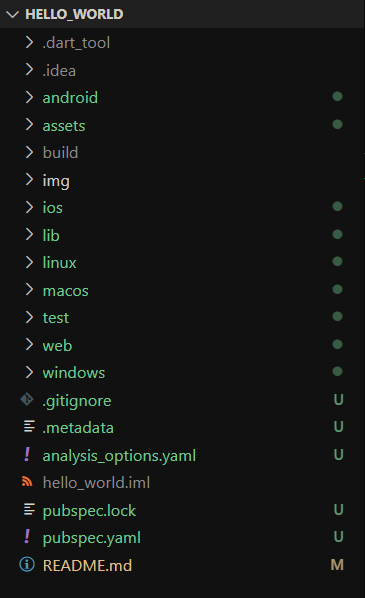
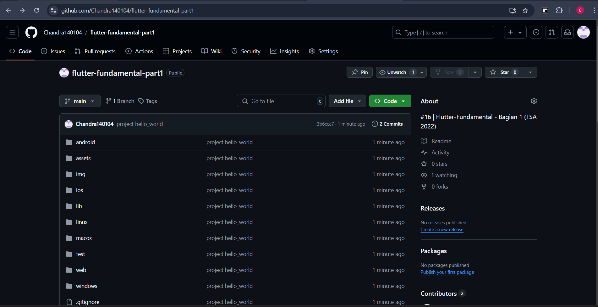
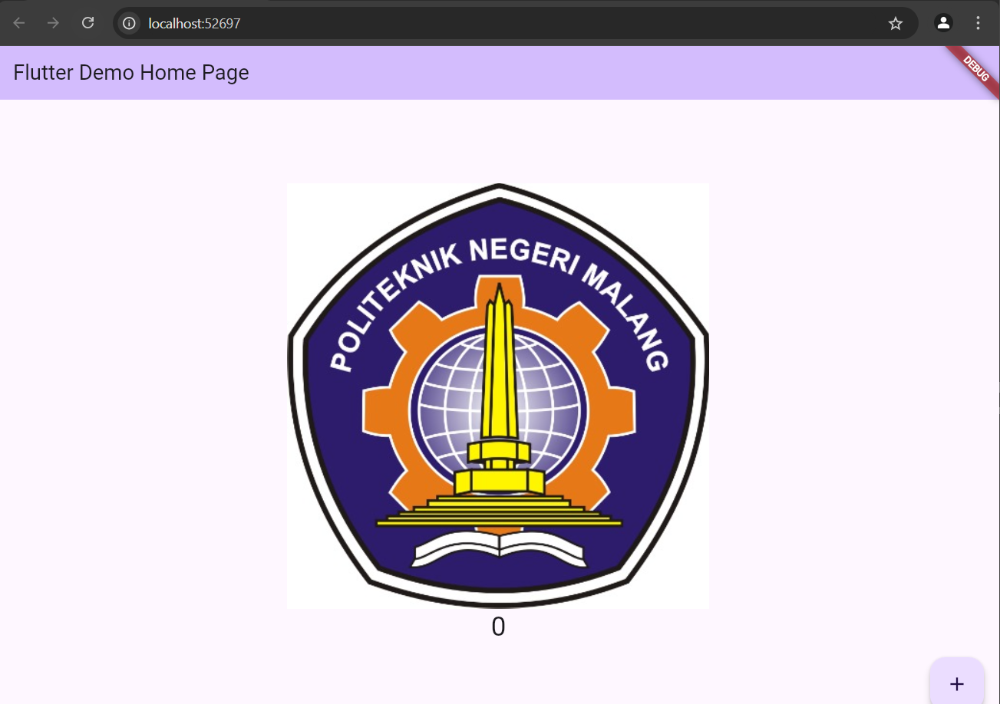
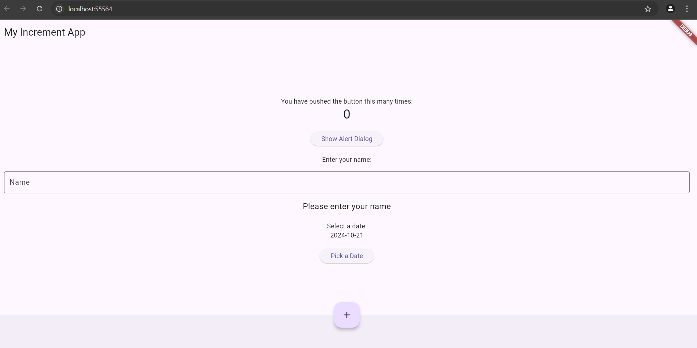

Nama : Chandra Bagus Sulaksono
Kelas : SIB-3D
NIM : 2241760079
# Praktikum 1 : Membuat Project Flutter Baru

- Jawab: Telah berhasil membuat project Flutter baru bernama hello_world

# Praktikum 2: Menghubungkan Perangkat Android atau Emulator

- Jawab: Berhasil dilakukan

# Praktikum 3: Membuat Repository GitHub dan Laporan Praktikum

- Jawab: Berhasil dilakukan

# Praktikum 4: Menerapkan Widget Dasar

- Jawab:  source code berhasil berjalan menampilkan gambar logo sesuai dengan tugas yang diberikan dosen. Hasil tampilannya seperti yang terlihat pada screenshot, di mana logo Politeknik Negeri Malang muncul di halaman utama aplikasi Flutter.

# Praktikum 5: Menerapkan Widget Material Design dan iOS Cupertino

- Jawab: 

1. Scaffold Widget
Scaffold adalah salah satu widget dasar dalam Flutter yang menyediakan struktur dan tata letak umum untuk sebuah halaman aplikasi. Dalam kode ini, Scaffold digunakan untuk membuat struktur aplikasi dengan beberapa elemen utama:

AppBar: Pada bagian ini, terdapat AppBar yang menampilkan judul aplikasi (title), yaitu "Contoh Date Picker".
Body: Bagian body dari Scaffold diisi dengan sebuah Center widget, yang memastikan konten berada di tengah layar. Di dalamnya terdapat sebuah Column yang menampilkan tanggal terpilih dan sebuah tombol untuk memunculkan Date Picker.

2. Dialog Widget
Dalam kode ini, dialog widget yang digunakan adalah Date Picker. Date Picker sendiri sebenarnya adalah bentuk dari dialog khusus yang disediakan oleh Flutter untuk memudahkan pengguna memilih tanggal dari kalender.

Fungsi _selectDate memanfaatkan fungsi showDatePicker, yang merupakan sebuah dialog modal. Ini artinya, ketika Date Picker muncul, pengguna harus berinteraksi dengan dialog tersebut sebelum dapat kembali ke aplikasi.
Dialog ini muncul ketika tombol "Pilih Tanggal" ditekan, dan menampilkan kalender bagi pengguna untuk memilih tanggal.
Setelah tanggal dipilih, dialog ditutup, dan tanggal yang dipilih ditampilkan pada layar.

3. Input dan Selection Widget
Input dan Selection Widget di Flutter adalah widget yang memungkinkan interaksi pengguna, seperti memasukkan teks, memilih opsi, dan lain sebagainya. Dalam contoh ini, elemen selection ditunjukkan melalui tombol untuk memilih tanggal:

ElevatedButton: Tombol ini digunakan untuk memicu pemilihan tanggal. Ketika ditekan, fungsi _selectDate dipanggil yang menampilkan dialog Date Picker.
Text: Setelah pengguna memilih tanggal, elemen Text akan memperlihatkan tanggal yang telah dipilih, menunjukkan hasil interaksi pengguna dengan widget Date Picker.

4. Date and Time Pickers
Komponen utama dalam kode ini adalah Date Picker, yang memungkinkan pengguna untuk memilih tanggal tertentu dari sebuah dialog kalender:

showDatePicker adalah fungsi bawaan Flutter yang menampilkan dialog kalender untuk memilih tanggal.
selectedDate: Adalah variabel DateTime yang menyimpan tanggal yang dipilih. Awalnya, variabel ini diinisialisasi dengan tanggal saat ini (DateTime.now()), namun akan diperbarui jika pengguna memilih tanggal lain.
initialDate, firstDate, dan lastDate: Parameter ini menentukan batasan tanggal yang dapat dipilih oleh pengguna.

